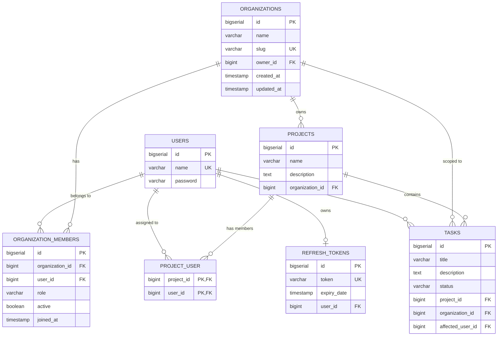

# MY-EPM — Enterprise Project Management Platform
## Application Overview & Architecture Guide

---

## 1. 📌 What is MY-EPM?

**MY-EPM (Enterprise Project Management)** is a multi-tenant, SaaS-ready backend platform built to manage organizations, cross-functional teams, projects, and tasks with granular security and tenant data isolation.

### Key Highlights
- **SaaS Multi-Tenancy**: Organizations serve as isolated workspace boundaries. Users can belong to multiple organizations with distinct roles in each.
- **Relational Domain Modeling**: Clean JPA entity mappings (Many-to-One, Many-to-Many, One-to-Many) ensuring referential integrity and cascading lifecycle rules.
- **Declarative Security**: Spring Security SpEL expressions (`@PreAuthorize("@orgSecurity.isMember(...)")`) protect resources at the method level.
- **Dual-Token Authentication**: Stateless JWT access tokens coupled with database-backed refresh tokens for secure session continuity.
- **Automated Schema Evolution**: Append-only, versioned Flyway database migrations (V1 through V6).
- **Fast, Deterministic Test Suite**: Unit and standalone MockMvc test suites covering controllers, services, and security utilities without database dependencies.

---

## 2. 🧰 Technology Stack & Libraries

| Category | Technology | Version / Details | Purpose |
| :--- | :--- | :--- | :--- |
| **Language** | Java | 17 | Core programming language |
| **Framework** | Spring Boot | 3.2.0 | Core application framework |
| **Web & REST** | Spring MVC | 3.2.0 | HTTP request routing, REST controllers, validation |
| **Security** | Spring Security | 3.2.0 | Authentication filter chain, Method Security, BCrypt |
| **JWT Tokens** | JJWT (`jjwt-api`, `jjwt-impl`, `jjwt-jackson`) | 0.11.5 | HMAC-SHA256 signing, validation, claims parsing |
| **Data Access** | Spring Data JPA / Hibernate | 3.2.0 | ORM, repositories, entity lifecycle management |
| **Database** | PostgreSQL | 14+ compatible | Relational storage for tenant data |
| **Migrations** | Flyway Core | 3.2.0 | Version-controlled database schema migrations |
| **Object Mapping**| MapStruct | 1.6.3 | Compile-time, type-safe entity $\leftrightarrow$ DTO mappings |
| **Validation** | Jakarta Bean Validation | Hibernate Validator | Input validation constraints (`@NotBlank`, `@NotNull`, `@Size`) |
| **Testing** | JUnit 5, Mockito, Spring Security Test | 3.2.0 | Unit tests, Mockito mocks, and MockMvc web testing |
| **Build Tool** | Apache Maven | 3.8+ | Dependency management and build lifecycle |

---

## 3. 🏗️ Architecture & Design Patterns

The codebase is organized modularly by business domain under `com.projectmanagement`:

```
backend/src/main/java/com/projectmanagement/
├── auth/                  # Authentication, JWT utilities, Refresh Tokens, Security Config
├── organization/          # Tenant management, members, roles, OrgSecurity bean
├── project/               # Project domain: model, repository, service, DTOs, mappers, controller
├── task/                  # Task domain: model, repository, service, DTOs, mappers, controller
├── user/                  # User entity, repository, service, controller, mappers
└── common/                # Shared DTOs, exceptions, and GlobalExceptionHandler
```

### Architectural Patterns Applied
1. **Layered Architecture**:
   $$\text{Client (HTTP / REST)} \longrightarrow \text{Controller} \longrightarrow \text{Service} \longrightarrow \text{Repository (Spring Data JPA)} \longrightarrow \text{PostgreSQL}$$
2. **DTO & Mapper Pattern**:
   - Entities are never exposed directly to external clients.
   - Separate request DTOs (`CreateProjectDto`, `TaskCreateDto`, etc.) and response DTOs (`ProjectResponseDto`, `TaskResponseDto`).
   - MapStruct generates optimized bytecode mappings at compile-time with zero reflection overhead.
3. **Multi-Tenant Security (`OrgSecurity`)**:
   - Custom Spring bean `@Component("orgSecurity")` evaluated in SpEL expressions:
     - `@PreAuthorize("@orgSecurity.isMember(#orgId)")`: Verifies caller belongs to the target organization.
     - `@PreAuthorize("@orgSecurity.hasRole(#orgId, 'OWNER', 'ADMIN')")`: Enforces administrative permissions.
4. **Global Exception Handling**:
   - [`GlobalExceptionHandler`](file:///home/kalil/learn/spring%20boot/roadmap/EPM/backend/src/main/java/com/projectmanagement/common/exception/GlobalExceptionHandler.java) intercepts domain exceptions (`ProjectNotFoundException`, `TaskNotFoundException`, `UserNotFoundException`, `TokenRefreshException`, `AccessDeniedException`, `MethodArgumentNotValidException`) and maps them to standard JSON `ErrorResponse` envelopes.

---

## 4. 🗄️ Database Schema & Entity Relationships



---

## 5. 🚀 Currently Implemented Features

### Feature 1: Authentication & Session Management (`/api/v1/auth`)
- **User Registration (`POST /register`)**: Hashes passwords using BCrypt and persists new user accounts.
- **User Login (`POST /login`)**: Authenticates via `AuthenticationManager`, issues a signed JWT access token and a database refresh token, and returns the user's default active organization context.
- **Refresh Token Rotation (`POST /refreshtoken`)**: Validates refresh token expiration against the database and issues fresh JWT access tokens without requiring re-login.
- **Stateless Authorization Filter**: `AuthTokenFilter` validates incoming `Authorization: Bearer <token>` headers on every secured request.

### Feature 2: Multi-Tenant Organizations (`/api/v1/organizations`)
- **Tenant Creation**: Automatically assigns the creator as `OWNER`.
- **Role-Based Access Control (RBAC)**: Supports roles `OWNER`, `ADMIN`, `MEMBER`, and `GUEST`.
- **Member Management**: Administrators (`OWNER` / `ADMIN`) can add new users with designated roles.
- **Active Workspace Switching**: Allows users belonging to multiple organizations to switch their active tenant workspace (`POST /{id}/switch`).

### Feature 3: User Management (`/api/v1/users`)
- CRUD operations for users.
- Inverse JPA relation mapping to associated projects (`@ManyToMany(mappedBy = "members")`).

### Feature 4: Projects Management (`/api/v1/projects`)
- **Organization Scoping**: Every project strictly belongs to an organization (`@ManyToOne`).
- **Team Assignment (Many-to-Many)**: Projects can have multiple assigned member users via the `project_user` join table.
- **Tenant Integrity Verification**: Adding a member verifies that the user already belongs to the project's parent organization before linking.
- **Lifecycle Cascade**: Deleting a project cascades deletion to all associated tasks and member associations.

### Feature 5: Tasks Management (`/api/v1/tasks`)
- **Full JPA Relationships**: Tasks reference `Project` (`@ManyToOne`), `Organization` (`@ManyToOne`), and an optional assigned `affectedUser` (`@ManyToOne`).
- **Status Workflow**: Tracks task progress (e.g. `TODO`, `IN_PROGRESS`, `DONE`).
- **Cross-Tenant Assignment Validation**: Assigning a user to a task validates that the assignee is an active member of the target organization.
- **Flexible Lookups**: Filter tasks by Project ID, by Organization ID, or by Assigned User ID.

### Feature 6: Database Versioning (Flyway Migrations)
- **`V1__init_auth_schema.sql`**: Initial users table.
- **`V2__init_organization_schema.sql`**: Organizations and organization_members tables.
- **`V3__add_active_flag_to_organization_members.sql`**: Active organization workspace indicator.
- **`V4__create_project_table.sql`**: Projects table with foreign key to organizations.
- **`V5__create_project_user_join_table.sql`**: Many-to-many join table for project members.
- **`V6__create_task_table.sql`**: Tasks table with foreign keys to projects, organizations, and users.

### Feature 7: Automated Test Suite
- **48 Automated Tests** covering all layers:
  - `JwtUtilsTest`: Token creation, parsing, validation, expiry checks.
  - `RefreshTokenServiceTest`: Creation, reuse, expiration verification, deletion.
  - `UserDetailsServiceImplTest`: Loading user details and exception handling.
  - `AuthControllerTest`: MockMvc tests for register, login, refresh token, bad credentials, validation errors.
  - `UserServiceTest` & `UserControllerTest`: User creation, retrieval, and 404 handling.
  - `ProjectServiceTest`: Project creation, member assignment, tenant boundary checks.
  - `TaskServiceTest`: Task creation, status updates, cross-tenant assignee validation.
- All tests pass in **under 10 seconds** with `BUILD SUCCESS`.

---

## 6. 📋 Complete API Endpoints Reference

### Authentication (`/api/v1/auth`)
| Method | Path | Security Guard | Description |
| :--- | :--- | :--- | :--- |
| `POST` | `/api/v1/auth/register` | Public | Register new user account |
| `POST` | `/api/v1/auth/login` | Public | Authenticate and retrieve JWT + Refresh Token |
| `POST` | `/api/v1/auth/refreshtoken` | Public | Exchange refresh token for fresh access token |

### Organizations (`/api/v1/organizations`)
| Method | Path | Security Guard | Description |
| :--- | :--- | :--- | :--- |
| `POST` | `/api/v1/organizations` | Authenticated | Create a new organization |
| `GET` | `/api/v1/organizations/my` | Authenticated | List organizations of the authenticated user |
| `GET` | `/api/v1/organizations/{id}` | `@orgSecurity.isMember(#id)` | Get organization details by ID |
| `GET` | `/api/v1/organizations/slug/{slug}` | Authenticated | Get organization by unique slug |
| `POST` | `/api/v1/organizations/{id}/members` | `@orgSecurity.hasRole(#id, 'OWNER', 'ADMIN')` | Add member to organization |
| `GET` | `/api/v1/organizations/{id}/members` | `@orgSecurity.isMember(#id)` | List all organization members |
| `POST` | `/api/v1/organizations/{id}/switch` | `@orgSecurity.isMember(#id)` | Switch active organization workspace |

### Projects (`/api/v1/projects`)
| Method | Path | Security Guard | Description |
| :--- | :--- | :--- | :--- |
| `POST` | `/api/v1/projects` | `@orgSecurity.isMember(#request.organizationId)` | Create a new project |
| `GET` | `/api/v1/projects/{id}?orgId={orgId}` | `@orgSecurity.isMember(#orgId)` | Get project by ID |
| `GET` | `/api/v1/projects/organization/{orgId}` | `@orgSecurity.isMember(#orgId)` | List all projects in an organization |
| `PUT` | `/api/v1/projects/{id}?orgId={orgId}` | `@orgSecurity.isMember(#orgId)` | Update project name or description |
| `DELETE` | `/api/v1/projects/{id}?orgId={orgId}` | `@orgSecurity.isMember(#orgId)` | Delete project and cascade tasks |
| `POST` | `/api/v1/projects/{id}/members/{userId}?orgId={orgId}` | `@orgSecurity.isMember(#orgId)` | Add member to project |
| `DELETE` | `/api/v1/projects/{id}/members/{userId}?orgId={orgId}` | `@orgSecurity.isMember(#orgId)` | Remove member from project |

### Tasks (`/api/v1/tasks`)
| Method | Path | Security Guard | Description |
| :--- | :--- | :--- | :--- |
| `POST` | `/api/v1/tasks` | `@orgSecurity.isMember(#request.organizationId)` | Create a task under a project |
| `GET` | `/api/v1/tasks/{id}?orgId={orgId}` | `@orgSecurity.isMember(#orgId)` | Get task details by ID |
| `GET` | `/api/v1/tasks/project/{projectId}?orgId={orgId}` | `@orgSecurity.isMember(#orgId)` | List tasks in a project |
| `GET` | `/api/v1/tasks/organization/{orgId}` | `@orgSecurity.isMember(#orgId)` | List tasks in an organization |
| `GET` | `/api/v1/tasks/user/{userId}?orgId={orgId}` | `@orgSecurity.isMember(#orgId)` | List tasks assigned to a user |
| `PUT` | `/api/v1/tasks/{id}?orgId={orgId}` | `@orgSecurity.isMember(#orgId)` | Update task title, description, or status |
| `DELETE` | `/api/v1/tasks/{id}?orgId={orgId}` | `@orgSecurity.isMember(#orgId)` | Delete task |

### Users (`/api/v1/users`)
| Method | Path | Security Guard | Description |
| :--- | :--- | :--- | :--- |
| `POST` | `/api/v1/users` | Authenticated | Create a user |
| `GET` | `/api/v1/users/{id}` | Authenticated | Retrieve user by ID |
| `GET` | `/api/v1/users` | Authenticated | List all users |

---

## 7. 💻 How to Run and Test

### Compile the Application
```bash
cd backend
mvn clean compile
```

### Run the Automated Tests (48 Tests)
```bash
mvn test
```

### Start the Application
Ensure a PostgreSQL database named `epm_db` is available on port `5432`:
```bash
mvn spring-boot:run
```
On boot, Flyway will apply migrations `V1` through `V6` automatically, and the application will be listening on `http://localhost:8080`.
