# MY-EPM — Frontend Implementation Plan & TODO

This document defines the complete roadmap and implementation checklist for the **MY-EPM (Enterprise Project Management)** frontend application, matching the visual UI designs (`frontend/screens/`) with the Spring Boot backend REST APIs (`backend/`).

---

## 🗺️ Implementation Architecture & Sequence

```mermaid
flowchart LR
    P1["Phase 1: Public Landing"] --> P2["Phase 2: Auth & Tenant Onboarding Flow"]
    P2 --> P3["Phase 3: App Shell & Org Context"]
    P3 --> P4["Phase 4: Executive Dashboard"]
    P4 --> P5["Phase 5: Projects Management"]
    P5 --> P6["Phase 6: Tasks & Kanban Board"]
    P6 --> P7["Phase 7: Team & RBAC Governance"]
    P7 --> P8["Phase 8: Org Settings & Audit Logs"]
    P8 --> P9["Phase 9: E2E Integration & Polish"]
```
 

---

## 📋 Actionable Checklist

### Phase 1: SaaS Landing Page (`HomePage`)
- **Visual Reference:** `frontend/screens/home page of the sass.png`
- **Target File:** `frontend/src/features/home/pages/HomePage.tsx`

- [x] **1.1 Hero Section & Interactive Mockup Preview**:
  - Top navigation bar with brand logo (`MY-EPM`), links (*Features, Architecture, Security, Docs*), and CTAs (*Sign In*, *Start Free Trial*).
  - Hero typography: *"Enterprise Project Portfolio Management Built for Strategic Delivery"*.
  - Workspace switcher preview card and simulated milestone status bar.
- [x] **1.2 Value Proposition & Feature Cards**:
  - 4 showcase cards:
    1. *Multi-Workspace & Tenant Switching*
    2. *Role-Based Access & Governance (RBAC)*
    3. *Automated Milestone & Sprint Lifecycles*
    4. *Executive Insights & Portfolio Telemetry*
- [x] **1.3 Telemetry KPI Strip & Social Proof**:
  - Live performance metrics strip (99.99% Availability, 24ms Real-Time Latency, 500+ Organizations, 10M+ Tasks).
  - Enterprise customer testimonial cards and bottom conversion banner.

---

### Phase 2: Authentication & Multi-Step Tenant Onboarding Flow
- **Visual References:** `frontend/screens/login.png`, `frontend/screens/create organization step1.png`, `frontend/screens/create organization step2.png`
- **Target Files:** `frontend/src/features/auth/`, `frontend/src/features/organization/`

- [x] **2.1 Enterprise Sign-In Screen (`LoginPage.tsx` / `LoginForm.tsx`)**:
  - **Payload alignment**: Submit `{ username, password }` directly to `POST /api/v1/auth/login`.
  - **Routing logic**:
    - If user already belongs to one or more organizations (`organizations.length > 0`): set active organization in `orgStore` and redirect directly to `/dashboard`.
    - If user has NO organizations (`organizations.length === 0`): store session and redirect directly to the onboarding step (`/organizations/create`).
  - **Visuals matching mockup**:
    - Two-column Auth Layout with right-side enterprise guarantee card (*99.99% SLA, Data Protection, Multi-Tenant Workspace Isolation*).
    - Form fields: Optional Workspace slug auto-discovery hint, Username / Email input, Password input, *"Remember session"* checkbox.
    - Identity Provider federation buttons (SAML 2.0, Okta, Google Workspace UI stubs).
    - Footer links: *"Sign Up Free"* and *"Join with Slug →"*.

- [x] **2.2 Registration & Onboarding Entry (`RegisterPage.tsx` / `RegisterForm.tsx`)**:
  - **Mode Selection**: Toggle switch between *"Create New Organization"* and *"Join Existing via Slug"*.
  - **Registration Form**:
    - Fields: Preferred Username (required, with real-time availability check), Password (required, with strength meter chips: 8+ chars, uppercase, number, symbol), and Password Confirmation.
    - UI presentation fields: Full Name and Work Email.
    - Agreement checkbox: *"I agree to the Master Services Agreement and Privacy Policy"*.
  - **Execution & Auto-Login Flow**:
    1. Call `POST /api/v1/auth/register` with `{ username, password }`.
    2. Automatically authenticate by calling `POST /api/v1/auth/login` with `{ username, password }`.
    3. Store JWT tokens and user in `authStore`.
    4. Seamlessly transition the newly authenticated user to the **Organization Provisioning Wizard** (`/organizations/create`).

- [x] **2.3 Multi-Step Organization Provisioning Wizard (`OrgCreatePage.tsx` / `CreateOrganizationForm.tsx`)**:
  - **Wizard Step Indicator**:
    - *Step 1: Organization & Workspace* (Identity & boundary setup)
    - *Step 2: Projects & Workspaces* (Initial structure & templates)
    - *Step 3: Invite Team & Roles* (Member access & permissions)
    - *Step 4: Complete & Launch* (Final initialization)
  - **Choice A: Create New Organization**:
    - Inputs: Organization Name (e.g. `Acme FinTech Corp`), dedicated Workspace Slug auto-slugged (`acme-fintech`), Base Reporting Timezone, Primary Ledger Currency.
    - Optional team invite email tags with default role selector (`MEMBER`, `ADMIN`).
    - Multi-Tenant Cross-Access toggle.
    - Submit calls `POST /api/v1/organizations` with `{ name, slug }`.
    - On success: updates `orgStore` with the created organization as `activeOrganization` and navigates to `/dashboard`.
  - **Choice B: Join Existing Organization via Slug**:
    - Input: Organization Slug (e.g. `acme-corp`).
    - Query `GET /api/v1/organizations/slug/{slug}` to fetch and display the organization preview.
    - Submit join request or switch active organization.
  - **Right-Side Summary Panel**:
    - Plan badge (*Free Full Access*), Multi-Tenant Data Isolation security badge, unlimited seats counter, SOC-2 readiness checklist.

---

### Phase 3: Dashboard Shell & Multi-Tenant Navigation
- **Visual Reference:** `frontend/screens/dashboard.png`
- **Target Files:** `frontend/src/layouts/DashboardLayout.tsx`, `frontend/src/stores/orgStore.ts`

- [x] **3.1 Global Collapsible Sidebar**:
  - Active tenant workspace badge with slug display (`Acme FinTech Corp /acme-fintech`).
  - Nav sections:
    - **Operations**: *Overview* (Dashboard), *Projects* (with count badge), *Tasks & Boards*, *Team & Access* (with `RBAC` badge).
    - **Administration**: *Org Settings*, *Security & Audit Logs*.
  - Bottom user profile pill with avatar, name, Global Admin badge, and *"Switch Tenant"* shortcut.
- [x] **3.2 Top Global Header**:
  - Breadcrumb navigation (`Home > Acme FinTech Corp > Dashboard`).
  - Real-time global search bar (keyboard shortcut `⌘K`).
  - Active tenant pill with `OWNER` role tag, notification bell, help icon, and system compliance badge.
- [x] **3.3 Active Tenant Switching Engine**:
  - Implement workspace switcher modal/dropdown wired to `POST /api/v1/organizations/{id}/switch`.
  - Invalidate TanStack Query caches upon switching tenant boundaries.

---

### Phase 4: Executive Dashboard Cockpit
- **Visual Reference:** `frontend/screens/dashboard.png`
- **Target File:** `frontend/src/features/dashboard/pages/DashboardPage.tsx`

- [x] **4.1 Top KPI Metric Cards**:
  - *Total Projects* (Active count, on-track vs. at-risk breakdown).
  - *Tasks in Pipeline* (In-progress count, To-Do / Active / Done metrics).
  - *Assigned Members* (Seats filled vs. quota, active RBAC tiers).
  - *Security & Isolation* (100% Strict compliance, 99.9% SLA).
- [x] **4.2 Portfolio & Projects Snapshot Table**:
  - Display active projects with domain tags (e.g. `V2`, `Core`, `High Prio`), team member avatar stacks, progress bars (`74%`, `91%`), and inline quick links (*View*, *Assign Member*, *Delete*).
- [x] **4.3 Real-Time Activity Ledger Stream**:
  - Live task event feed (e.g. *EPM-842 Q4 Strategic Budget Allocation Review updated by @kalil.s*).
  - Colored status tags (`IN_PROGRESS`, `DONE`, `TODO`).
- [x] **4.4 Right-Hand Sidebar Governance Widgets**:
  - Quick action buttons: *+ New Project*, *+ Create Task*, *+ Invite Member*.
  - Workspace Governance card (SSO provider info, session policy length, access level).
  - Active Tenant switcher quick dropdown.
  - Team Access thumbnail list with role tags (`OWNER`, `ADMIN`, `MEMBER`).

---

### Phase 5: Projects Portfolio Management
- **Visual Reference:** `frontend/screens/projects.png`
- **Target Files:** `frontend/src/features/project/pages/ProjectListPage.tsx`, `CreateProjectModal.tsx`, `AssignProjectMemberModal.tsx`, `ProjectCard.tsx`

- [x] **5.1 Projects KPI Banner & Toolbar**
- [x] **5.2 Projects Data Table & Grid**
- [x] **5.3 Create Project & Assign Members Modals**
- [x] **5.4 Backend Status Enum & CORS Integration**

---

### Phase 6: Tasks Management & Kanban Boards
- **Visual Reference:** `frontend/screens/Tasks.png`
- **Target Files:** `frontend/src/features/task/pages/TaskListPage.tsx`, `TaskDetailPage.tsx`

- [x] **6.1 Board Controls & Filtering**
- [x] **6.2 Kanban Workflow Lanes**
- [x] **6.3 Create / Edit Task Modal**

---

### Phase 7: Team & RBAC Access Control
- **Visual Reference:** `frontend/screens/Team & Access.png`
- **Target Files:** `frontend/src/features/organization/pages/OrgTeamPage.tsx`, `MemberTable.tsx`

- [ ] **7.1 Team & Access Metrics Strip**
- [ ] **7.2 Pending Join Requests Management**
- [ ] **7.3 Members Management Grid**
- [ ] **7.4 RBAC Permission Matrix Breakdown**

---

### Phase 8: Organization Settings, Tenancy & Audit Logs
- **Visual References:** `frontend/screens/Organization Settings.png`, `frontend/screens/Security & Audit Logs.png`
- **Target Files:** `frontend/src/features/organization/pages/OrgSettingsPage.tsx`, `OrgSecurityPage.tsx`

- [ ] **8.1 Organization Profile & Resource Quota Meters**
- [ ] **8.2 Workspace Policies & Danger Zone**
- [ ] **8.3 Security & Cryptographic Audit Logs**

---

### Phase 9: End-to-End Polish, Synchronization & Testing
- **Target Files:** `frontend/src/test/`, `frontend/vitest.config.ts`, `frontend/playwright`

- [ ] **9.1 Token Refresh Queue Verification**
- [ ] **9.2 Error Boundaries & Toast Feedback**
- [ ] **9.3 Unit & E2E Test Suite**
